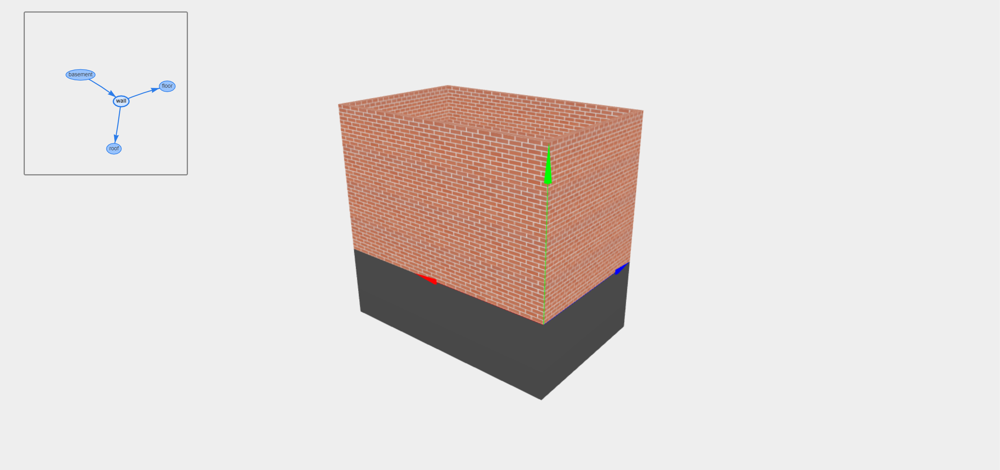

# Itsyra
Procedural generation of buildings.

Intended to use hierarchy of building elements and a system of mutial constraints to build corresponding details.

Also intended to generate Art Nouveau buildings, using varieties of forms and decor.
Seems to be turning into Soviet Panelka constructor instead :DD

## Tasks
* Reduce the complexity of custom door/hole position - make user choose from building elements like in Soviet Hrushevkas.
* So make a catalog of Panel House elements, and then make constraints between them.
* Think about elements decor after that.

